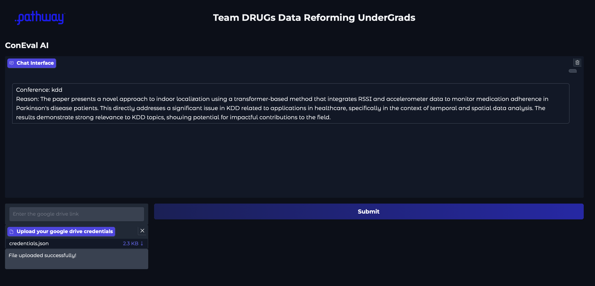

<h1>
  ConEval AI
</h1>


This project develops two frameworks: (1) Research Paper Publishability Assessment, classifying papers as "Publishable" or "Non-Publishable" based on quality, coherence, and methodology using a dataset of 150 papers; and (2) Conference Selection, recommending suitable conferences (e.g., CVPR, NeurIPS) for publishable papers with formal justifications. Pathway integration enables real-time data streaming and analysis.

### Demo UI 
  <div align="center">
  
</div>


## Methodology
- **Data Sources**: As the pipeline is designed to handle and work with dynamic data sources , we are giving the functionality that Google drive folder can serve as the source. 

### Streaming Pipeline 
  <div align="center">
  
</div>


## Usage

### Creating credentials.json in the Google API console:
- Go to https://console.cloud.google.com/projectcreate and create new project
- Enable Google Drive API by going to https://console.cloud.google.com/apis/library/drive.googleapis.com, make sure the newly created project is selected in the top left corner
- Configure consent screen:
  - Go to https://console.cloud.google.com/apis/credentials/consent
  - If using a private Gmail, select "External", and go next.
  - Fill required parameters: application name, user support, and developer email (your email is fine)
  - On the next screen click "Add or remove scopes" search for "drive.readonly" and select this scope
  - Save and click through other steps
- Create service user:
  - Go to https://console.cloud.google.com/apis/credentials
  - Click "+ Create credentials" and create a service account
  - Name the service user and click through the next steps
- Generate service user key:
  - Once more go to https://console.cloud.google.com/apis/credentials and click on your newly created user (under Service Accounts)
  - Note service user email address, it will be needed later
  - Go to "Keys", click "Add key" -> "Create new key" -> "JSON"
A JSON file will be saved to your computer. Move it to the folder where your Pathway script is located and rename it to credentials.json.

#### Insert Google Drive Folder Link
- Insert the link in the box provided on interface

#### Upload credentials created for google api console
- After entering the link you will be prompted to upload the `credentials.json` file


## Installation


### API Keys Setup

To enable seamless functionality and ensure reliable web query operations, you’ll need to generate API keys for the following services:


   **OpenAI API Key**
   - Create an account at [OpenAI](https://openai.com/).
   - Navigate to the [API Key management page](https://openai.com/product) after logging in.
   - Generate a new API key to access OpenAI services seamlessly.
 
  **GEMINI API Key**
    -Create an account at [Google AI Studio](https://aistudio.google.com/prompts/new_chat).
    - Navigate to the [Get API Key](https://aistudio.google.com/apikey)
     


---

### 1. Environment Setup

Export the following API keys to a source file (e.g., `bashrc`):

```bash
OPENAI_API_KEY={OPENAI_API_KEY}
GEMINI_API_KEY={GEMINI_API_KEY}

```


### Normal installation in Linux based systems
  ```bash
 
  pip install uv

  # make a vitual environment
  uv venv <path of venv> --python 3.10

  # activate the environment
  source <path of venv>/bin/acitvate

  uv pip sync requirements.txt
 
  

  # now in one terminal run fast_api_server.py
  # in other terminal run ui.py
  # now you can access the interface through url http://0.0.0.0:7860
  ```
